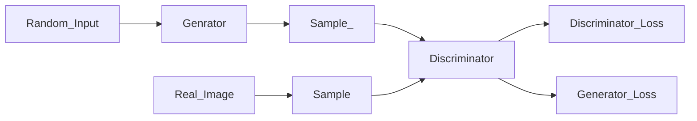

Forked from: https://github.com/sh-navid/AEye/blob/master/README.md

# AEye
- Disclaimer: Its on your own !!

## NN 

### Steps
1. Init
    1. Number of input/outpur nodes
    1. Hidden layers
    1. Neurons in each layer
1. Forward Propagation
1. Activation Function
    1. sigmoid
    1. tanh
    1. ReLU
1. Backward Propagation
1. Training NN
1. Testing NN

## GAN
### Flowchart

### Steps
1. Define Generator
    1. Create a function to generate random noise
1. Define Discriminator
    1. Create a function to distinguishes between real and generated data
1. Generate fake data
1. Define a traning loop
    1. Discriminator learns to distinguish between fake and real data
    1. Generator learns to create data that fools the Discriminator
    1. Each one tries to learn to outdo the other
1. Evaluate the GAN

___

## AI

### AI Domains

1. ML Machine learning
   1. Supervised Learning Algorithms
   1. Unsupervised Learning Algorithms
   1. Reinforcement Learning Algorithms
        1. Model-based
            1. Value Iteration
            1. Model Iteration
            1. Dyna-Q
        1. Model-free
            1. QLearning
            1. SARSA
            1. TD(λ)
1. NLP Natrual Language Processing
   1. Sentence Representation
   1. Graphical Topic Models
   1. Training with Classification Models
1. Vision
    >> To understand visual data
    1. CNN Convolutional Neural Networks
        >> Image recognition, classification and object detection
    1. RNN Recurrent Neural Networks
        >> Image captioning, scene description and video analysis
    1. YOLO You Only Look Once
        >> Real time object detection algorithm
    1. Mask R-CNN
        >> Extension of R-CNN
    1. [GANs Generative Adversarial Networks](https://realpython.com/generative-adversarial-networks/)
        >> To create material such as image, music, text, ...
    1. Siamese Networks
        >> Image classification and similarity learning
    1. CPMs Convolutional Pos Machines
        >> Human Pos estimation; location and orientation of joints
1. Speech
1. Robotics
1. Expert System
    1. Forward Chaining
    1. Backward Chaining
    1. Certainty Factor
    1. Case-based Reasoning
    1. Fuzzy Logic
    1. Bayesian Networks
    1. Decision Trees
1. Learning Curve Algorithms `Is this in correct category??`
    1. Methahuristic Algorithms
    1. Constrained Heuristic
    1. Hybrid Combination
1. Neural Network
    1. CNN
    1. DNN
    1. RNN

### AI Types

1. Self-Aware
1. Limited Memory
1. Theory of Mind
1. Reactive Machines
1. Artificial General Intelligence
1. Artificial Narrow Intelligence (ANI)
1. Artificial Super Intelligence (ASI)

#### ML

- Supervised Learning
  1. Regression
     - Linear
     - Polynominal
  1. Classification
     - KNN
     - SVM
     - NaiveBayse
     - Decision Tree
- Unsupervised Learning
  1. Clustering
     - KMeans
     - DBScan
     - MeanShift
     - FuzzyCMean
     - Hierarchical
     - Agglomerative
     - Knowledge-based
  1. Dimension Reduction (Generalization)
     - LDA
     - PCA
     - SVD
     - LSA
     - TSNE
  1. Pattern Search
     - Apriori
     - FPGrowth
- Ensemble Methods
  1. Bagging
     - RandomForest
  1. Stacking
  1. Boosting
- Reinforcment Learning
  1. A3C
    > [!WARNING]
    > `Is this in correct category??`
  1. SARSA
  1. QLearning
  1. GeneticAlgorithm 
    > [!WARNING]
    > `Is this in correct category??`
  1. DeepQNetwork (DQN)

### AI Usage
1. Online shopping
1. Fraud prevention
1. Autonomous vehicles
1. Facial recognition
1. Hiring
1. Gaming
1. Social media
1. Travel

### ML/AI Engines

### ML/AI Tools
1. [TensorFlow](https://www.tensorflow.org/)
1. [PyTorch](https://pytorch.org/)
1. [Keras](https://keras.io/)
1. Chain
1. Theano
1. Auto-WEKA
1. KNIME
1. BigML
1. Scikit-learn
1. Accord.NET
1. Google Cloud AutoML
1. Azure Machine Learning Studio
1. Amazon Machine Learning (AML)

### ML/AI Plugins

### ML/AI Apps
- [Perplexity](https://www.perplexity.ai)
- [DeepSeek](https://www.deepseek.com)
- [Poe](https://poe.com/)
- [Pi.ai](https://pi.ai)

### Useful links
- [ ] [Getting started with ML](https://www.w3schools.com/python/python_ml_getting_started.asp)
- [ ] [Learn machine learning](https://www.springboard.com/blog/data-science/how-to-learn-machine-learning/)
- [ ] [Coding ML from scratch](https://www.enjoyalgorithms.com/blog/coding-ml-from-scratch/)
- [ ] [ML from scratch](https://github.com/eriklindernoren/ML-From-Scratch)
- [ ] [Mastering machine learning](https://www.kdnuggets.com/2022/02/7-steps-mastering-machine-learning-python.html)
- [ ] [Artificial neural network classification](https://www.analyticsvidhya.com/blog/2021/10/implementing-artificial-neural-networkclassification-in-python-from-scratch/)
- [ ] [Reinforcement Q-learning](https://www.learndatasci.com/tutorials/reinforcement-q-learning-scratch-python-openai-gym/)
- [ ] [ML introduction](https://dafriedman97.github.io/mlbook/content/introduction.html)
- [ ] [Machine learning with python](https://www.geeksforgeeks.org/machine-learning-with-python/)
- [ ] [Machine learning algorithms from scratch](https://www.kaggle.com/code/milan400/machine-learning-algorithms-from-scratch)
- [ ] [Generative Adversarial Networks](https://realpython.com/generative-adversarial-networks/)
- [ ] [Simpelest GAN Possible](https://towardsdatascience.com/pointgan-a-breakdown-of-the-simplest-gan-possible-3a15244dc508)
- [ ] [Simple GAN Model](https://medium.com/@wasuratme96/building-a-simple-gan-model-9bfea22c651f)
- [ ] [Develope a 1D GAN Model](https://machinelearningmastery.com/how-to-develop-a-generative-adversarial-network-for-a-1-dimensional-function-from-scratch-in-keras/)
- [ ] [NN for Dummies](https://www.freecodecamp.org/news/neural-networks-for-dummies-a-quick-intro-to-this-fascinating-field-795b1705104a/)
